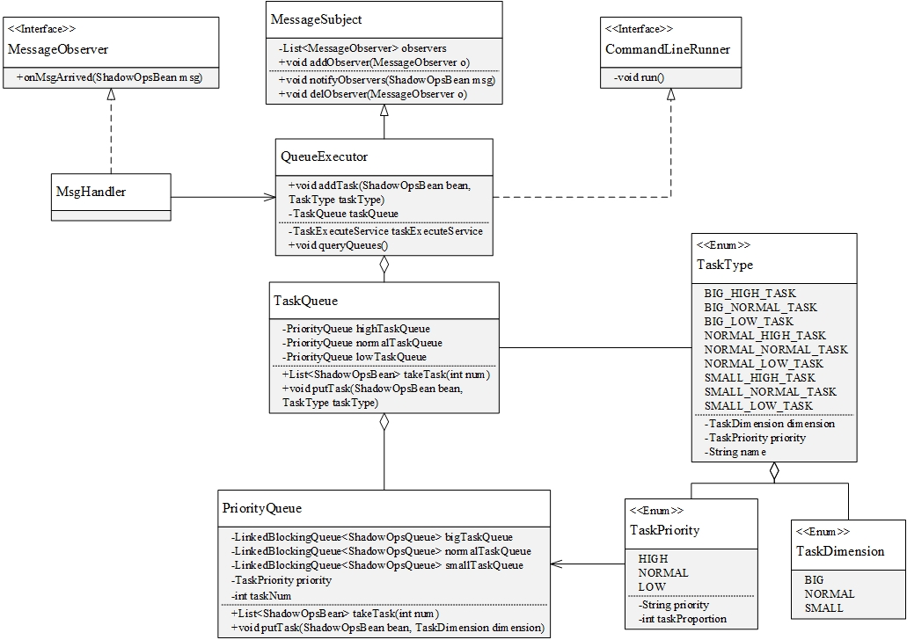

# shadow-queue设计
## 一、类图

## 二、设计目标
队列模块是第二次设计的时候在内存管理模块和通信模块之间插入的一个模块，
旨在使用一个优先级队列模式分流任务处理，解决任务阻塞以及任务饥饿的问题。
模块初始化一个线程池供处理任务使用，并开启一个定时任务查看线程池状态并分配任务，
之后仿照蓄水池算法，按照一定的优先级规则和概率取得队列中的任务，然后在线程池中分配线程处理任务。
## 三、数据结构
### 1. 队列结构
由类图可见，模块使用TaskQueue和PriorityQueue构成了9级优先级队列。任务优先级分为高优先级、
中优先级和低优先级三种，使用TaskPriority枚举类型标识，任务维度分为大型任务、一般任务和小型任务三种，
使用TaskDimension枚举类型区分。这三种优先级和三种任务维度的互相组合实现了9中优先级队列的划分。
### 2. 观察者模式
观察模式的引入为用户提供了一个可以获取到任务内容的接口，队列在分配处理任务的同时抄送任务内容给实现了观察者的用户，
让用户可以对任务内容作出自定义的一些处理。
## 四、实现细节
### 1. 队列中的任务获取
（TaskQueue, PriorityQueue）  
首先，获取线程池中可使用的空线程的数量以及队列中未执行的任务总数，
按照要获取的任务数和每个优先级所占任务比例分配每个优先级队列中应该获取的任务数量，
其中优先级比例默认高:中:低=6:3:1，判断任务数量与被分配的线程数量，上级队列未使用的空闲线程数量执行向下流转。  
之后在每个PriorityQueue中实际获取任务，获取任务仿照蓄水池算法，遍历队列的同时获取任务，
每次取到任务的概率为 ***需获取的任务数 / 此优先级中的任务总数***，
循环获取任务直到拿到指定数量的任务或者取走所有任务。
### 2. 线程池的使用
（TaskExecuteService, ExecutorConfig）  
模块在初始化时会启动一个线程池在处理任务时使用，线程池参数可以在项目文件中进行配置。
模块配置TaskExecuteService中的executeTask方法作为线程池中线程的使用者来处理分配到的任务。
### 3. 任务分配
（QueueExecutor）  
在executor中使用@Scheduled注解配置定时任务，每50ms查询一次队列，
获取到指定数量的任务并分配到线程池中的空闲线程中，同时向所有的观察者抄送一份任务。