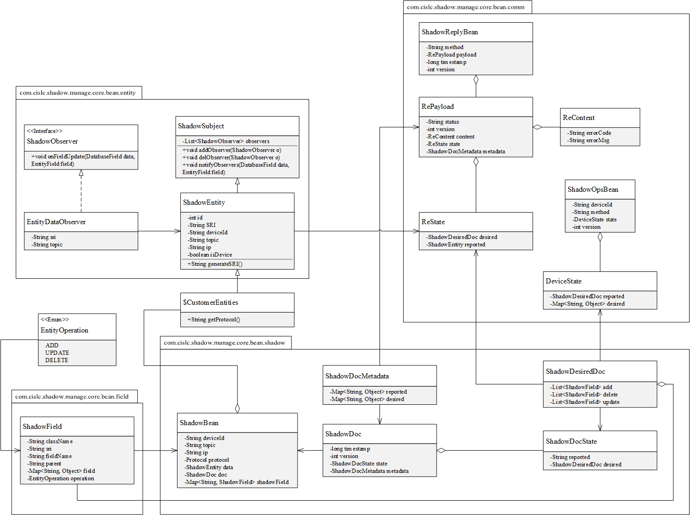

# shadow-manage设计
## 一、类图
shadow包中为内存影子类组成，comm包中为通信使用的bean

## 二、设计目标
内存管理模块是对设备影子进行管理的核心模块，提供了设备提交状态时自动修改内存和数据库的功能，
以及用户修改影子后下发修改到设备的功能。在实现内存影子的事务性上，引入了影子文档机制以及内存回滚机制。
对影子内存的加锁采用了信号量这种粒度较大的锁机制。
## 三、数据结构
### 1. 设备影子结构
设备在内存中抽象出来的模型称为影子对象，用来描述组成影子对象的各个类称为影子实体。
设备影子的核心类是ShadowBean，除了真正的设备对象外，这个类中还记录了设备id，mqtt主题，coap的ip，
通信协议，影子文档和影子属性变更这些数据，是整个处理逻辑的核心。其中最为关键的是ShadowDoc属性，
又叫影子文档，对象中保存了设备最后上报的设备状态并以序列化的形式进行存储，是内存实体在发生异常时进行回滚的基础，
对象中也保存了服务器对设备的期望数据，服务端在修改内存数据后将修改的内容暂存到这个期望区域中，
在合适的时候由用户手动触发下发到设备。另外一个关键属性是shadowField记录变更属性的map，
在这里存储了用户对内存实体属性的修改，包括修改的对象、修改的属性名、修改之前的值和修改之后的值。
由于JPA不能同时加载一个对象中的两个List属性，在服务端的对象中使用Set解决。
### 2. 观察者模式
使用观察者模式记录用户对设备实体中字段的修改，并在实体对应的ShadowBean的shadowField中保存修改记录，
省去了在提交时对字段的前后比较过程。观察者模式作用的范围有限，仅能够记录影子实体中普通变量的变化，
对于Set属性中的增删无法得到，只能通过后续的比较算法再行记录。
### 3. 对象标识
为了索引所有的内存设备，使用生成的唯一设备id（deviceId）来标识内存中的影子对象及ShadowBean。
除影子对象外，影子实体使用影子资源标识符（Shadow Resource Identifier, SRI）进行索引。
## 四、实现细节
### 1. 影子对象及影子实体管理
设备的影子对象存储在ShadowBean中，与构成设备的影子实体都交由Spring IoC容器进行管理。
ShadowBean使用deviceId进行索引，影子实体使用SRI进行索引。
### 2. 使用设备端上报值更新影子
设备端上报的数据中，add和delete是针对List类型属性的，需要把响应的实体在list中删除或新增，
update针对普通属性，根据上传的属性名和属性值以及所属对象的SRI修改内存中的变量，
在这个修改过程中如果出现了异常，则使用shadowDoc中的值重置内存对象。
在更新完成后将更新的数据持久化到数据库并更新shadowDoc中的值。如果设备端上报的desired为null，
说明期望的值已经成功下发到设备，则清空影子文档中的期望值和ShadowBean中的属性变化值。
### 3. 数据持久化
使用spring-data-jpa持久化框架，对修改后的实体直接调用相应的JpaRepository进行保存，
保存的过程使用线程池异步处理，不阻塞内存处理。
### 4. 记录变更属性
普通属性使用观察者模式记录属性变更，Set属性将内存中的对象与影子文档中的对象进行对比，
取得删除的影子实体和新增的影子实体，在ShadowBean中保存变更。
### 5. 服务端更新影子并提交
服务端更新影子并下发到设备借鉴了git的提交方式分为两步，第一步commit到暂存区，在影子文档中暂存修改，
第二步push是真正的下发，将文档中的期望数据下发到设备。commit中首先使用影子文档中的值与内存对象的值进行对比，
获取到增加的和删除的影子实体并记录到shadowField中，接着根据这些变化值更新文档中的desired值，
最后使用文档中的reported值回滚内存数据，这样做的目的是保持内存数据与设备数据的一致性。
### 6. 服务端下发数据更改
下发数据是将影子文档中的desired部分序列化然后下发到设备。
### 7. 内存对象加锁
为了保证多线程下的内存安全，对内存对象采用了信号量整体加锁的方式，
每个ShadowBean同时只有一个线程可以访问并修改。当线程请求获取设备影子的时候记录线程名称与设备id之间的关系。
之所以没有采用针对每个属性进行加锁这样更小粒度的锁，是因为List类型变量的线程不安全性使得模块无法确保整体的线程安全，
所以只能对内存对象整体加锁。
### 8. 内存事务实现
内存事务采用切面实现，在使用影子设备的方法上加上@ShadowService注解，当方法抛出异常时自动使用影子文档回滚内存数据，
在方法结束时自动释放获取的信号量。
### 9. 设备绑定
用户在服务端与设备端为绑定使用约定一个唯一码（bindCode），由设备端发起，通过一次绑定通信确立服务端影子与实体设备的对应关系，
在这次通信中服务端将生成的deviceId下发到设备端，之后便使用这个deviceId进行通信
