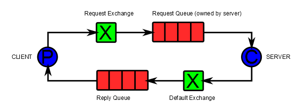

# rabbitmq
[管理页面](http://120.78.133.4:15672/#/)  登录名、密码均为 guest

使用消息uuid和回调标志位确定由哪个接口执行。

mqtt服务端启动时，根据设备自身的id，监听唯一的队列。
当有消息进入时，取得对方 id、默认队列名称、requesturl、data、是否为响应、消息的uuid
组装成 InMQTTMessage 并根据uuid调用相应的回调。

消息发送时（首次发送），装入设备id、默认监听队列名称、请求的url、数据、
不是响应、产生一个uuid、如果有回调将uuid和回调存入map。

消息发送（响应），装入设备id、默认监听队列名称、数据、是响应、uuid、如果有回调将uuid和回调存入map。